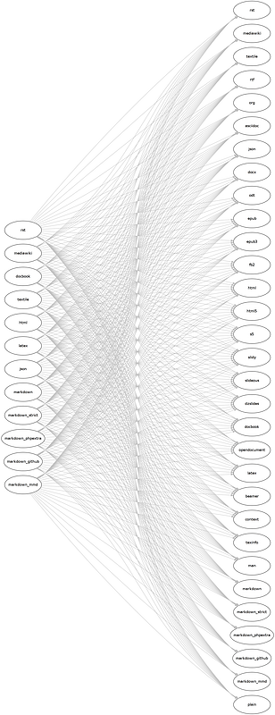
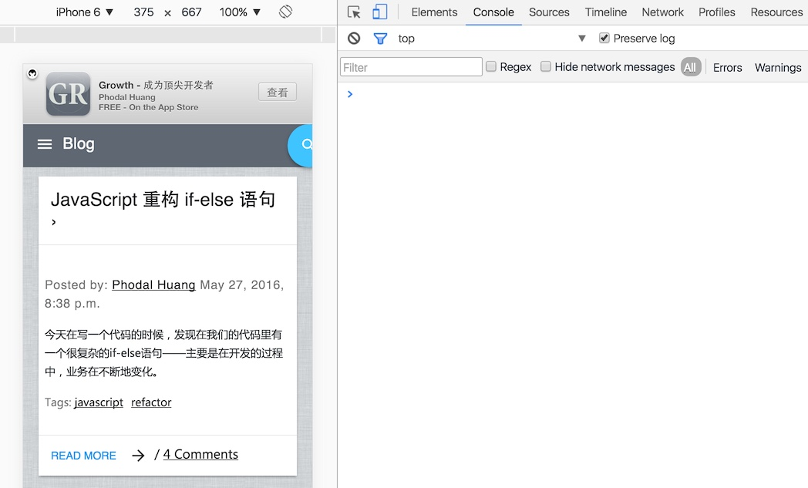
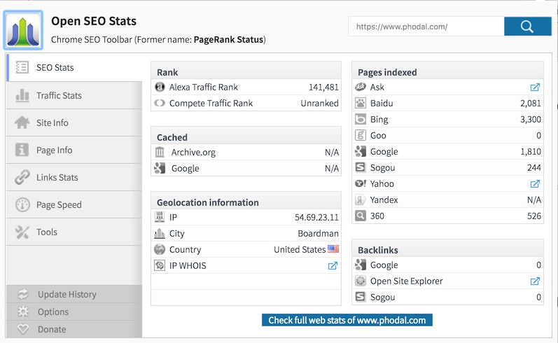
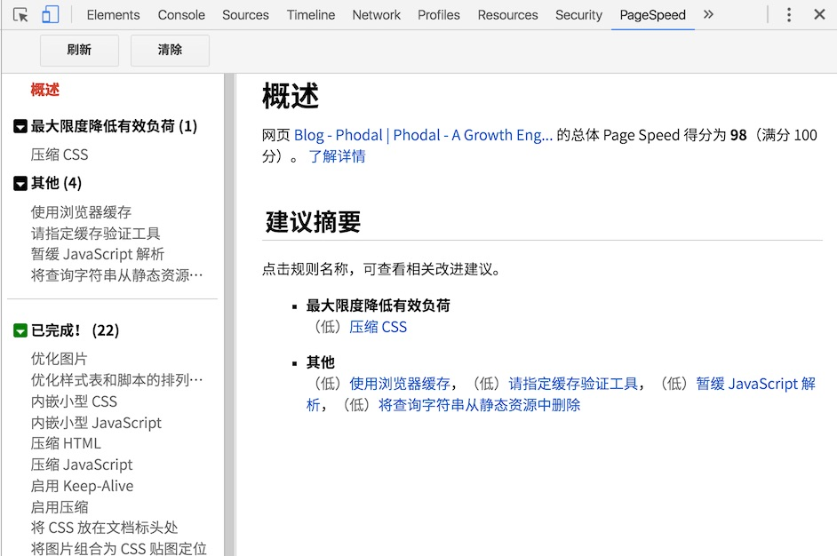
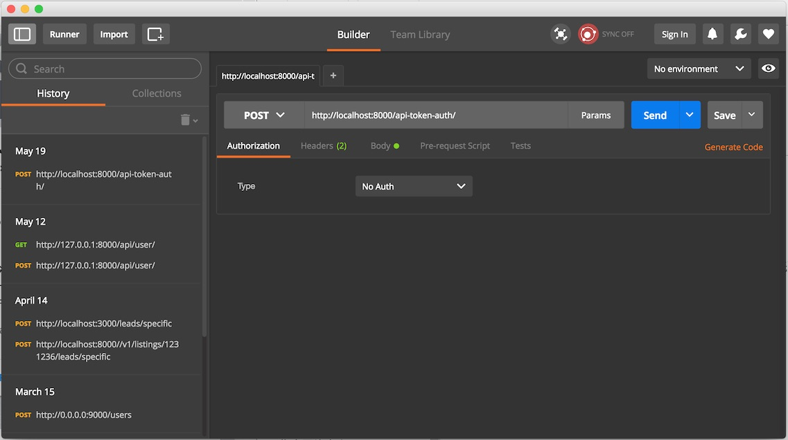
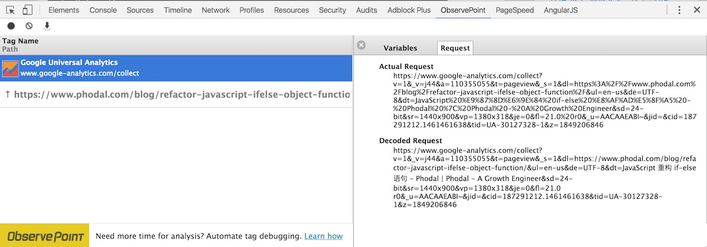
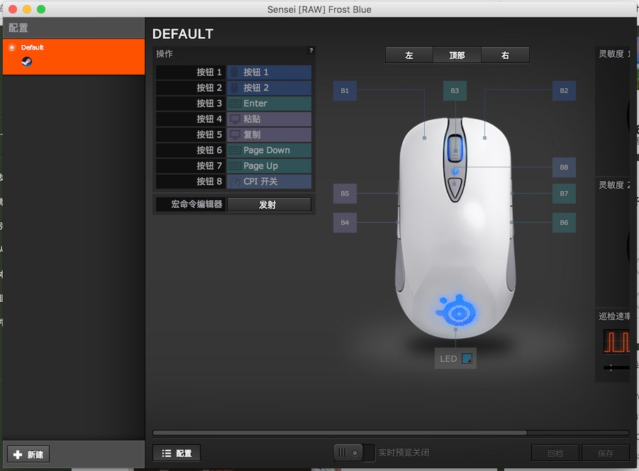
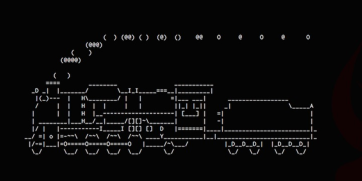

文档篇
===


Pandoc
---

> Pandoc是一个标记语言转换工具，可实现不同标记语言间的格式转换，堪称该领域中的“瑞士军刀”。

可以将 markdown、 reStructuredText、 textile、 HTML、 DocBook、 LaTeX、 MediaWiki markup、 TWiki markup、 OPML、 Emacs Org-Mode、 Txt2Tags、 Microsoft Word docx、 LibreOffice ODT、 EPUB、 Haddock markup

转化为

XHTML、 HTML5、 以及HTML幻灯片Slidy， S5，或者DZSlides、Microsoft Word docx、 OpenOffice/LibreOffice ODT、 OpenDocument XML、EPUB、DocBook、 GNU TexInfo、 Groff man pages、LaTeX、 ConTeXt、 LaTeX Beamer slides、PDF via LaTeX、Markdown、 reStructuredText、 AsciiDoc、 MediaWiki markup、 Emacs Org-Mode、 Textile

上图



我最常用的就是：将md转化为workd及pdf。我的毕业论文及之前的几本电子书都是这么做的，它是一个命令行工具，安装方式：

 - Windows: choco install pandoc
 - Ubuntu/CentOS/OpenSUSE: apt-get intall pandoc 或者 yum install pandoc
 - Mac OS: brew install pandoc

使用方式如下：

      pandoc fullstack.md -o fullstack.docx

如果要转为PDF，则需要另外的一个工具——LaTeX

Graphviz
---

> Graphviz （英文：Graph Visualization Software的缩写）是一个由AT&T实验室启动的开源工具包，用于绘制DOT语言脚本描述的图形。它也提供了供其它软件使用的库。

简单的来说，就是将代码转换为图形:


它让我最惊讶的是DOT语言，简直是以我们平时的用法来定义的。上面的图形的代码类似于这样的：

    home->products->widgets

又是一个让人惊呆的黑科技，这才是人类应该使用的语言。它可以支持PostScript，PDF，SVG，PNG等一系列的格式，用法

     dot -T png phodal.dot -o phodal.png

简单、粗暴到没有朋友。

ImageMagick
---

> ImageMagick (TM) 是一个免费的创建、编辑、合成图片的软件。它可以读取、转换、写入多种格式的图片。图片切割、颜色替换、各种效果的应用，图片的旋转、组合，文本，直线，多边形，椭圆，曲线，附加到图片伸展旋转。

来自重点：可以支持超过两百多种格式。It can read and write images in a variety of formats (over 200) including PNG, JPEG, JPEG-2000, GIF, TIFF, DPX, EXR, WebP, Postscript, PDF, and SVG.

它提供了一个命令行工具叫：``convert``，这可以自由地转换图片的形式，如：

    convert image.jpg image.png

还可以加各种效果，如：


顺便做个介绍：上面的这个人叫瑞典模特儿莱娜·瑟德贝里，是在刊于1972年11月号《花花公子》杂志上的一张裸体插图照片的一部分。**她的脸部与裸露的肩部已经变成了事实上的工业标准。**

又是一个简单、粗暴到没有朋友的工具。

TeX 和 Latex
---

TeX是由是一个由美国计算机教授高德纳（Donald Ervin Knuth）编写的功能强大的排版软件。顺便推荐一下他写的一本书：《计算机程序设计艺术》。因为：

> 高德纳最早开始自行编写TEX的原因是当时十分粗糙的排版水平已经影响到他的巨著《计算机程序设计艺术》的印刷质量。他以典型的黑客思维模式，最终决定自行编写一个排版软件：TEX。他原本以为他只需要半年时间，在1978年下半年就能完成，但最终他用了超过十年时间，直到1989年TEX才最终停止修改。


这直接让我想起Martin Fowler在写《领域特定语言》里好像也是用DSL。Tex的最大优点是可以写出下面的这本复杂的公式：


LaTeX 建立在 TeX 之上的工具，它在TeX的基础上大大改善了易用性。对了，如果只是一般的用途的话，就没有必要拿去装逼了~。

它也是工作于命令行上的工具。

Jupyter Notebook
---

Jupyter Notebook使用浏览器作为界面，其前身是Ipython Notebook，Ipython3.0之后新建为Jupyter项目。它支持Markdown、Python语言交互、R语言交互、图形显示、运行时间分析、LaTex公式，对于交互编程、数据分析和数据可视化非常有用。


**安装（使用pip）**

    $ pip install jupyter

**运行**

    $ jupyter notebook

官网：[Jupyter](https://jupyter.org/)


Gitbook
---

Gitbook是一个命令行工具(node.js库)，可以把你的Markdown文件汇集成起来，生成一个静态网站，也可以输出为PDF等多种格式。


**安装（使用npm）**

    $ npm install gitbook -g

**使用**

    $ gitbook init ＃ 初始化书籍目录
    $ gitbook serve ＃ 运行

官网：[Gitbook](https://www.gitbook.com/)

图形工具篇
===

在上一篇《全栈工程师的百宝箱：黑魔法之文档篇》我们介绍了一些文档工具，今天让我来分享一下，我常用的一些图形工具。

## 流程图：Graphviz

说到流程图还是再次提及一下，我们之前说到的**Graphviz** 。

> Graphviz （英文：Graph Visualization Software的缩写）是一个由AT&T实验室启动的开源工具包，用于绘制DOT语言脚本描述的图形。它也提供了供其它软件使用的库。

它的主要特点是代码生成图像，并且足够的简单。

在我的那个“Web Developer 成长路线图”(GitHub: [https://github.com/phodal/developer](https://github.com/phodal/developer))里，就是用这个工具生成下面这个复杂的图形。


而其代码特别简单——和我们平时表达的手法是一样的，即：

```
"包管理" -> "包发布" -> "自动部署"
"CLI" -> "部署"
"脚本语言(Bash,Perl,Ruby,Python etc)" -> "部署"
"脚本语言(Bash,Perl,Ruby,Python etc)" -> "构建"
"*nix" -> "软件编译" -> "部署"
"构建" -> "软件编译"
```

 Graphviz有一个大的优点和弱点是：自动生成，导致画线的时候很出现出问题。接着，我们就来看看手动画线的例子。

## 流程图： Visio vs Dia vs OmnIGraffle

在Windows世界里，在这一类的工具里面最常见的算是Visio:


遗憾的是，它并不支持在Mac OS上使用。而且，它并不在我购买的Office 365套装里。

在Mac世界里，最好的工具算是OmniGraffle，就是很贵——我们平时使用的是公司的Mac电脑，使用盗版软件是有法律风险的。


在GNU/Linux世界里，我们使用Dia。

> Dia 是开放源代码的流程图软件，是GNU计划的一部分，程序创立者是Alexander Larsson。Dia使用单一文件界面模式，类似于GIMP与Inkscape。 Dia将多种需求以模块化来设计，如流程图、网络图、电路图等。各模块之间的符号仍是可以通用的，并没有限制。


顺便安利一下，我最喜欢的操作系统OpenSuSE——简洁、尾长、绿色。


OpenSuSE在KDE桌面下效果最赞了——因为KDE和OpenSuSE都是德国制造。总的来说，会比Debian系的Debian和Ubunt，及RetHat系的CentOS及Fedora稳定、漂亮。

令人遗憾的是这三个工具，我都用不了。Mac对X Windows的支持不是一般的差，于是我就需要别的替代工具。

## 在线流程图：Processon

这个工具还是相当好用，至少是在GxFxW内比较快——我之前使用过Creately、draw.io、Gliffy等等的一些工具，只是随着版图的扩展，很多地区都已经“xx”了。


不过遗憾的是：他们没有给我广告费。

> ProcessOn是一个在线协作绘图平台，为用户提供最强大、易用的作图工具！支持在线创作流程图、BPMN、UML图、UI界面原型设计、iOS界面原型设计等。

同样的，在我的那个“Developer进阶书单”（GitHub: [https://github.com/phodal/booktree](https://github.com/phodal/booktree))中，就是用这个工具画出规规矩矩的线。


并且，它还是跨平台的。

## 各种图： Word和Excel

由于翻译和写书的需要，我成了一个Office 365订阅用户。于是发现在Word等一系列的Office工具中，自带了一个SmartArt的工具：


可以画出很多很有意思的图形，比如：


又或者是：


分分钟就能画一个的节奏。

## 脑图： XMind

我想这个一般人都是知道的。

> XMind思维导图软件被著名互联网媒体Lifehacker评选为“最佳头脑风暴和思维导图工具”及”最受欢迎的思维导图软件”。

它有一个很大的优点是使用了全球最先进的Eclipse RCP 软件架构，支持跨平台使用。它有一个很大的缺点是使用了全球最先进的Eclipse RCP 软件架构，导致了有点卡。

相比于流程图什么的，它只适合做脑图。


如果你还在使用Eclipse，那么你应该试试Intellij IDEA了。

## 各种图：D3.js

> D3.js（D3或Data-Driven Documents）是一个用动态图形显示数据的JavaScript库，一个数据可视化的工具。

与上面的工具相比，这个工具可能没有那么方便。但是，作为一个数据可视化工具，它不仅仅可以做出各种炫酷的图形。

还可以做出一个技能树：


这个项目的GitHub见：[https://github.com/phodal/sherlock](https://github.com/phodal/sherlock)

## 地图：Leaflet

> Leaflet 是一个为建设移动设备友好的互动地图，而开发的现代的、开源的JavaScript 库。

虽然它与上面的图形没有啥关系，但是它带了一个图字啊。与Google Map原生的API，或者OpenStreet相比，它最大的优点是对移动设备支持好。

并且，它也是一个可以根据数据（GEOJSON，地理数据）生成图形的工具。


Chrome插件篇
===

Chrome DevTools
---

在我所用过的这些前端工具里，最常用、实用的就属Chrome自带的DevTools。通常情况下，我们只需要使用这个工具就可以完成大部分的工作了。



每个前端工程师，都应该好好学习如何去使用Chrome DevTools。当然，这并不是一篇详细的关于Chrome DevTools的介绍——相关的内容足够写一本书了。除了正常的Debug功能，它可以模拟移动设备，模拟网络、模板分辨率、模拟，并在HTTP请求中带上相应的User Agent方便我们调试。

Open SEO Stats
---

顾名思义这是一个SEO状态查询工具，它可以让我们查看网站的SEO相关信息。也是一个非常棒的反诈骗软件，因为一个好的网站的Alexa Traffic Rank、PR以及Pages indexed（索引数）等等都会相对较高。



除了基本的SEO状态显示，它还提供了一些有效的工具，来帮助我们优化页面的SEO。如在Page Info里，会罗列出页面的相关标签是否完整。在Links Stats里，会帮我们检查页面的外链情况等等。

PageSpeed Insights
---

这是Google的PageSpeed Insights的插件版（网页版见： [https://developers.google.com/speed/pagespeed/insights/](https://developers.google.com/speed/pagespeed/insights/)），一个非常棒的网页优化工具，有了它就可以让我们轻松对网页进行优化。我们所需要做的事情就是点击“分析”按钮，然后就坐等他分析完成。

如下就是我博客的一个分析结果：



总体分数98分，看来我针对这个所说的东西进行优化的效果还不错。左边显示了我博客存在的一些问题，如：

 - 没有压缩CSS
 - 可以使用浏览器缓存
 - 需要指定缓存验证工具
 - 暂缓JavaScript解析
 - 将查询字符从静态资源中删除

等等的几个问题——这些已经都是小问题了。所以他们的重要等级是“低”，一般来说如果有一个等级是“高”整个评分就会特别低。

除此，我们还可以使用命令行工具来对你的网页进行测试。

[https://github.com/addyosmani/psi](https://github.com/addyosmani/psi)

安装：

``` shell
$ npm install --global psi
```

只需要执行下面的命令即可：

``` shell
psi http://www.example.com/
```

如我的博客的结果:

``` shell
--------------------------------------------------------

URL:       phodal.com
Strategy:  mobile
Speed:     90
Usability: 96

CSS size                                   | 30.04 kB
HTML size                                  | 11.8 kB
Image size                                 | 41.08 kB
JavaScript size                            | 28.07 kB
CSS resources                              | 1
Hosts                                      | 2
JS resources                               | 1
Resources                                  | 5
Static resources                           | 3
Total size of request bytes sent           | 695 B

Leverage browser caching                   | 1.5
Main resource server response time         | %
```

再依据不同的结果对网页进化优化，不过它有一个前提是它并不适合SPA（单页面）应用。

Postman
---

我相信这个软件，搞过Web开发的人都听过。



同样的，你仍然可以使用命令行工具来测试它。

[Newman](https://github.com/postmanlabs/newman)

XPath Helper
---


ObservePoint Tag Debugger
---


Capture Webpage Screenshot Entirely
---

外设篇
===

带有自定义按钮的鼠标
---



机械键盘
---

红轴

机械键盘手托
---

游戏鼠标线夹
---

笔记本支架折叠
---

魔方插座 
---


DevOps
======

Nginx Pagespeed
---

Boom
---

GoAccess
---


硬件篇
===

Raspberry Pi
---

Arduino
---

### Arduino Yun

### Arduino Uno

### Arduino ADK

### Arduino Lilypad

NodeMCU
---

Spark
---

API
===


Postman
---

Moco
---

Swagger
---


CLI
===

tree
---


sl
---



curl
---

Backend
===

Spring
---

Spring Boot
---

Laravel
---

Django
---

Express
---

WordPress
---

Ruby On Rails
---
